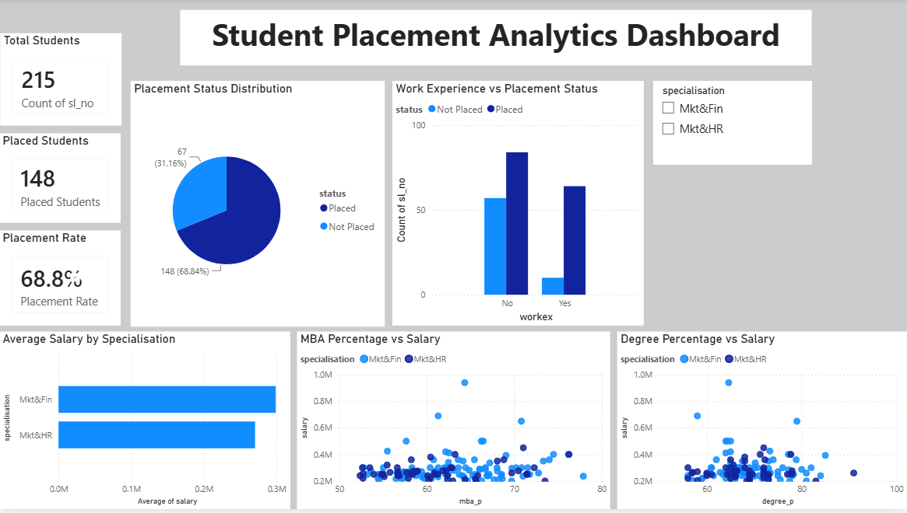

# Student Placement Analytics Dashboard

## Overview

This project analyzes student placement data using SQL and Power BI to identify trends in placement outcomes, salary distribution, work experience impact, and academic performance.

The dashboard provides interactive visualizations that help understand factors influencing student placements and salary offers.

---

## Tools & Technologies

- SQL (SQLite)
- Power BI
- Microsoft Excel
- CSV Dataset

---

## Dataset Information

The dataset contains information about:

- Academic performance (SSC, HSC, Degree, MBA)
- Specialisation
- Work experience
- Placement status
- Salary offered

Total Records: 215 Students

---

## Business Questions Answered

1. What is the overall placement rate?
2. How many students were placed?
3. Does work experience influence placement outcomes?
4. Which specialisation receives higher salary packages?
5. Is there a relationship between academic performance and salary?
6. What are the salary trends among placed students?

---

## Dashboard Features

### KPI Cards
- Total Students
- Placed Students
- Placement Rate

### Visualizations
- Placement Outcome Distribution
- Work Experience vs Placement Status
- Average Salary Across Specialisations
- MBA Score vs Salary Offered
- Degree Score vs Salary Offered

### Interactive Filters
- Specialisation Slicer

---

## Key Insights

- 148 out of 215 students were placed.
- Overall placement rate is approximately 68.8%.
- Students with work experience showed better placement outcomes.
- Marketing & Finance students received slightly higher average salaries.
- Academic scores alone do not strongly determine salary offers.

---

## Project Structure

```text
Placement-Analytics-Dashboard
│
├── README.md
├── Placement_Analytics_Dashboard.pbix
├── dashboard.png
├── dataset.csv
└── sql_queries.sql
```

---

## Dashboard Preview


---

## Author

Praniti Sethi

B.Tech Electrical & Computer Engineering

Thapar Institute of Engineering & Technology

IEEE PES Student Chapter Chairperson
